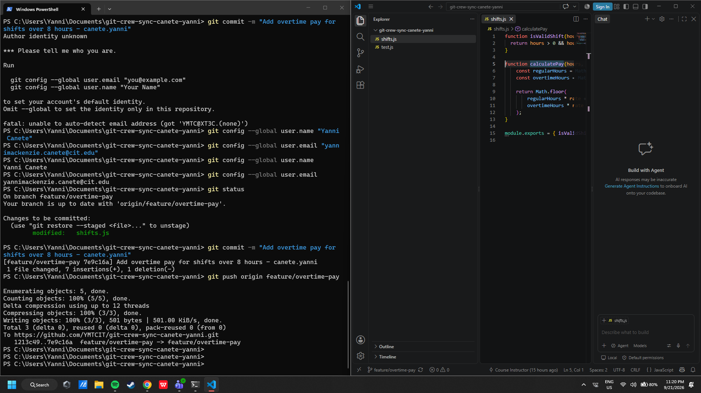
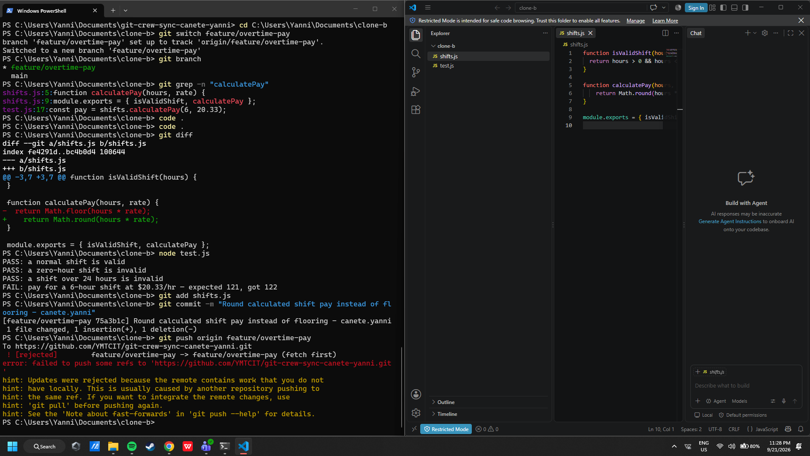
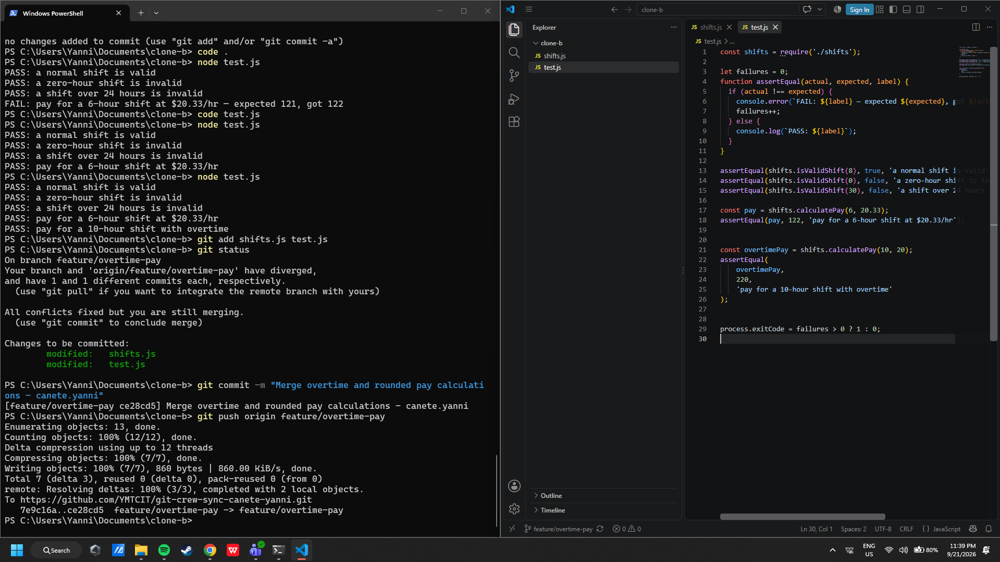
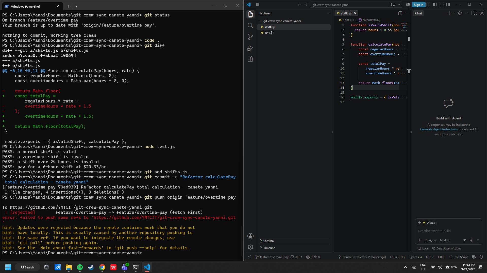
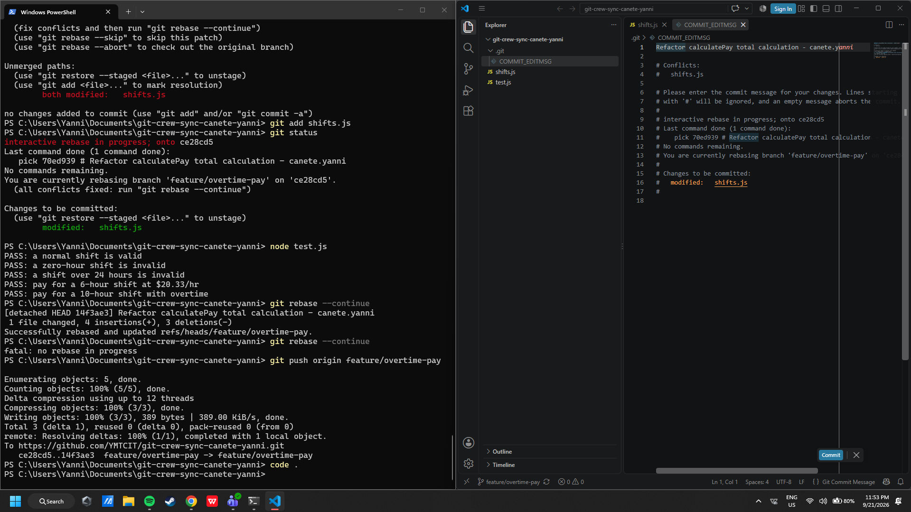
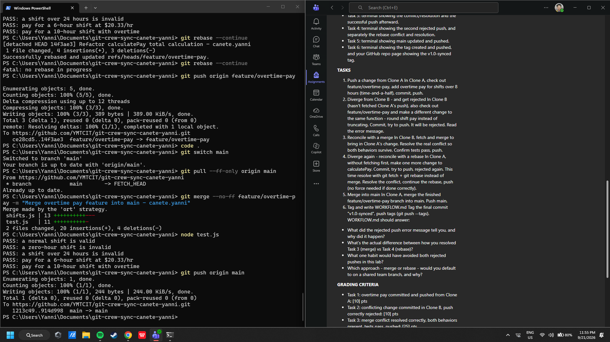
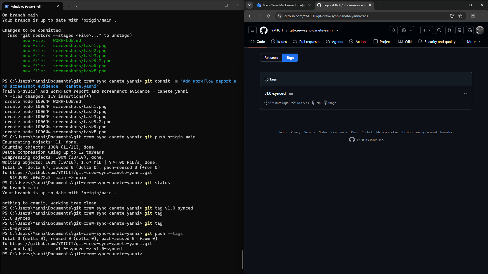

# Git Crew Sync Workflow

**Student:** Yanni Mackenziie Canete  
**Repository:** git-crew-sync-canete-yanni

---

## Task 1 - Push a Change from Clone A

In Clone A, I checked out the `feature/overtime-pay` branch and modified `calculatePay()` so that the first 8 hours use the normal rate while hours beyond 8 are paid at time-and-a-half.

I committed the change using the required naming convention and pushed it to the shared GitHub repository.

### Evidence

---

## Task 2 - Diverge from Clone B and Get Rejected

Clone B had not fetched the change made by Clone A. I modified the same `calculatePay()` function so that calculated pay uses `Math.round()` instead of `Math.floor()`.

After committing the change, I attempted to push it. Git rejected the push because the remote branch already contained work from Clone A that Clone B did not have locally.

### Evidence

---

## Task 3 - Reconcile with a Merge

In Clone B, I fetched the newest remote changes and merged `origin/feature/overtime-pay` into my local feature branch.

The merge produced a conflict in `shifts.js` because both clones modified the same `calculatePay()` function. I manually resolved the conflict so that both behaviors survived:

- Hours beyond 8 are paid at time-and-a-half.
- The final calculated pay uses `Math.round()`.

I updated the tests, confirmed that they passed, committed the merge, and pushed the resolved branch.

### Evidence

---

## Task 4 - Reconcile with a Rebase

Clone A was intentionally left outdated. I made another change to `calculatePay()` by introducing a `totalPay` variable and committed it without fetching Clone B's newer work.

My push was rejected because the remote feature branch contained commits that Clone A did not have.

### Rejected Push Evidence

I then fetched the remote branch and used:

`git rebase origin/feature/overtime-pay`

The rebase produced a conflict in `shifts.js`. I resolved it so that the final function preserved overtime pay, `Math.round()`, and the `totalPay` refactor.

All tests passed after the resolution, the rebase completed successfully, and I pushed normally without using force.

### Rebase Evidence

---

## Task 5 - Merge into Main

In Clone A, I switched to `main`, updated it from the remote, and merged the completed `feature/overtime-pay` branch into it.

I ran the tests again and confirmed that all tests passed before pushing `main` to GitHub.

### Evidence

---

## Task 6 - Tag the Final Version

The completed project was tagged as `v1.0-synced` and the tag was pushed to the GitHub repository.

### Evidence

---

# Written Answers

## 1. What did the rejected push error message tell you, and why did it happen?

The rejected push told me that the remote `feature/overtime-pay` branch contained commits that were not present in my local branch. Git rejected the push because accepting it directly would have overwritten or ignored newer remote history instead of performing a normal fast-forward update.

This happened because one clone pushed new work while the other clone remained outdated and attempted to push without first synchronizing with the remote repository.

## 2. What's the actual difference between how you resolved Task 3 (merge) vs Task 4 (rebase)?

In Task 3, I used a merge. Git combined the local and remote histories and created a separate merge commit after I resolved the conflict. Both lines of development remained visible in the commit history.

In Task 4, I used rebase. Git took my local refactor commit and replayed it on top of the newest remote history. After resolving the conflict, Git created a new version of my local commit, resulting in a more linear history.

## 3. What one habit would have avoided both rejected pushes in this lab?

A habit of synchronizing with the remote repository before beginning new work or before pushing would have avoided both rejected pushes. Running `git fetch` and checking whether the remote branch contains newer commits would show that another developer had already pushed changes.

In a normal team workflow, I would synchronize before modifying a shared branch instead of assuming my local branch is current.

## 4. Which approach - merge or rebase - would you default to on a shared team branch, and why?

I would normally default to merge when integrating already-published work on a shared team branch because merge preserves the existing commit history and does not rewrite commits that other developers may already be using.

I would use rebase mainly for my own unpublished local commits before sharing them because it can keep the history more linear without disrupting other developers' work.